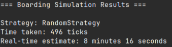

# Boarder Factory




A sophisticated airplane boarding simulator that implements and compares different boarding strategies to optimize passenger loading time.

## Overview

BoarderFactory simulates various airplane boarding strategies using various different design patterns. The simulation tracks each passenger's boarding progress using an internal counter system that represents the time taken for actions like stowing bags and finding seats.

## Features

- Multiple boarding strategies:
  - Front-to-Back: Loads passengers from front to back
  - Back-to-Front: Loads passengers from back to front
  - Random: Random passenger order
  - Column: Loads by column position

- Passenger types with different baggage combinations:
  - Duty-free bags
  - Overhead bags
  - Under-seat bags

- Real-time visualization of boarding process
- Performance metrics for each strategy
- Logging system for detailed analysis

## Running the Simulation

1. Git clone the repository
2. Navigate to the BoarderFactory directory
3. Run the simulation with logging:
```bash
java src/Main.java 2> output.log
```

The simulation will display a visual representation of the boarding process and output timing results for each strategy.

## Project Structure

```
BoarderFactory/
├── src/
│   ├── simulation/     # Core simulation logic
│   ├── ui/            # Visualization components
│   ├── interceptor/   # Logging system
│   └── Main.java      # Entry point
└── docs/              # Documentation and images
```
